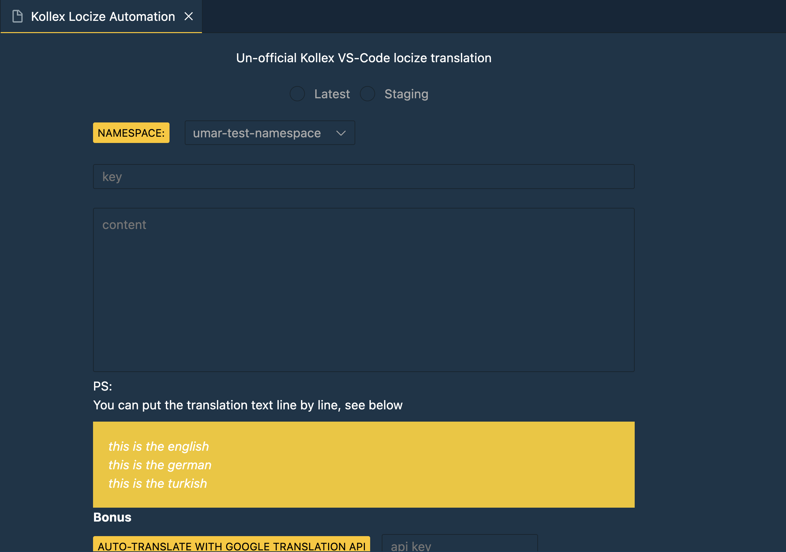
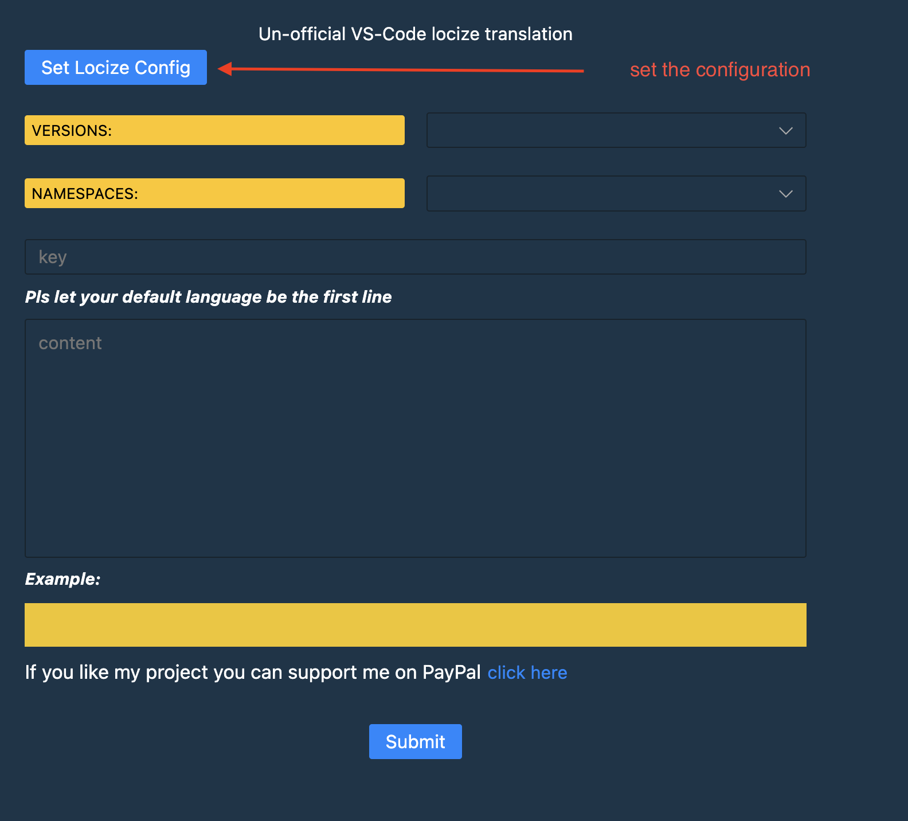

# Un-official VS-Code locize translation

Un-official VS-Code locize translation to automatically update keys, and translation texts

*tip: This project was Scaffolded using [yeoman](https://yeoman.io/learning/)



*tip: set the config



## Documentation

For a deeper dive into how this sample works, read the guides below.

- [Extension structure](./docs/extension-structure.md)
- [Extension commands](./docs/extension-commands.md)
- [Extension development cycle](./docs/extension-development-cycle.md)

## Navigate into directory

cd vscode-locize-extension

## Install dependencies for both the extension and webview UI source code

npm run install:all

## Build webview UI source code

npm run build:webview

## Open sample in VS Code

Once the sample is open inside VS Code you can run the extension by doing the following:

1. Press `F5` to open a new Extension Development Host window
2. Inside the host window, open the command palette (`Ctrl+Shift+P` or `Cmd+Shift+P` on Mac) and type `Automate Locize Translations`

## Package the extension for use

```bash
 npm install -g vsce
 vsce package
```

## Installing the extension locally

Or open the command palette (Ctrl+Shift+P / Cmd+Shift+P on macOS), type and select: Extensions: Install from VSIX..., then select your .vsix file
